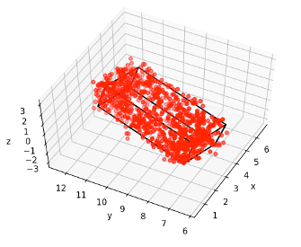
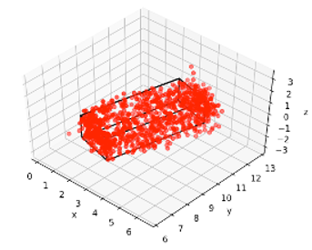
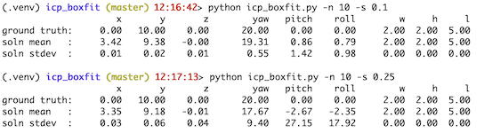

# icp_boxfit
Estimate a single 3D bounding box for bounding-box shaped ptcloud, with options to play
with the estimation and plot points.  Goal is to explore the stability of ICP and
different formulation variations for this purpose, using all open-source components.
The icp.py file is from Clay Flannigan's open src https://github.com/ClayFlannigan/icp
module, duplicated here to packagize and to allow me to explore tweaks to its algo.

  


## usage
implemented from other code:

```
import icp_boxfit
# do something to obtain A, an Nx3 ndarray of xyz triplets for ptcloud
x_est, y_est, z_est, yaw_est, pitch_est, roll_est, w_est, h_est, l_est, _, _ = estimate_bbox(A)
```

calling demonstration from cmdline:

```
> python icp_boxfit.py --help
usage: icp_boxfit.py [-h] [-p] [-pp] [-s SIGMA] [-N NUMPTS] [-n NUMREPS] [-r]
                     [-i INFILE] [-o OUTFILE] [-x X] [-y Y] [-z Z] [-Y YAW]
                     [-P PITCH] [-R ROLL] [-W W] [-H H] [-L L]

optional arguments:
  -h, --help              show this help message and exit
  -p, --plotbox           plot soln box
  -pp, --plotpts          plot soln box & ptcloud
  -s SIGMA, --sigma SIGMA
                          sigma of noise to add to ptcloud
  -N NUMPTS, --numpts NUMPTS
                          number of points in synthetic ptcloud
  -n NUMREPS, --numreps NUMREPS
                          number of run repetitions
  -r, --runstats          when set, output stats on the run misfit
  -i INFILE, --infile INFILE
                          optional input filename of csv file with x,y,z ptcloud
  -o OUTFILE, --outfile   OUTFILE
                          optional output filename of csv file of synthetically
                          generated x,y,z ptcloud
  -x X, --x X             synth generated box center x coord
  -y Y, --y Y             synth generated box center y coord
  -z Z, --z Z             synth generated box center z coord
  -Y YAW, --yaw YAW       synth generated box yaw
  -P PITCH, --pitch PITCH synth generated box pitch
  -R ROLL, --roll ROLL    synth generated box roll
  -W W, --w W             synth generated box width
  -H H, --h H             synth generated box height
  -L L, --l L             synth generated box length
  -cx CUTX, --cutx CUTX   remove synth generated pts with x > cutx
  -cy CUTY, --cuty CUTY   remove synth generated pts with y > cuty
  -cz CUTZ, --cutz CUTZ   remove synth generated pts with z > cutz
  -a, --allsolns          list every solution for -n (default is just mean/stdv at end)
```

## installation
```
cd icp_boxfit  # (this repo's dir)
python3 -m venv .venv
source .venv/bin/activate
pip install .
python icp_boxfit.py --help
```

## new:
Added a separate test module trying and demonstrating the icp() usage on a 2D problem.
Totally independent of all the 3D stuff above.
In ipython, or a notebook, or a python prompt, or in python code... :
```
import icp_test2d
icp_test2d.test2d(eps=.2, angle=20, offset=[10, 5], tol=1e-7)
# (arbitrarily chosen args in that call - this will output calculation results)
```
